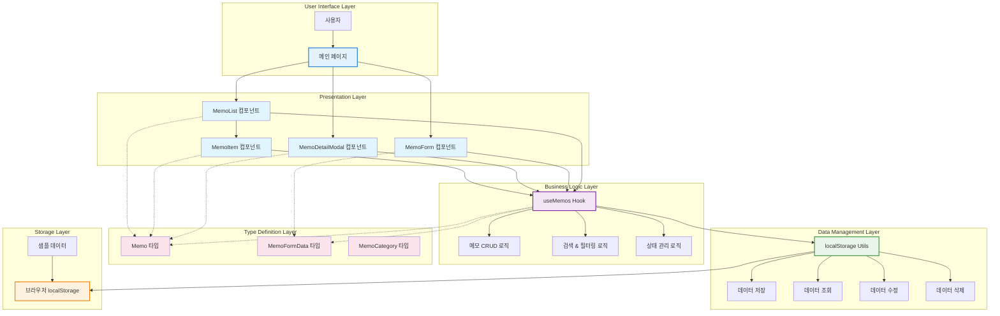

# 메모 앱 시스템 아키텍처

## 개요

이 다이어그램은 React/Next.js 기반의 메모 애플리케이션의 전체 시스템 아키텍처를 보여줍니다. 클라이언트 사이드 애플리케이션으로 localStorage를 통한 데이터 영속화를 제공합니다.

## 시스템 아키텍처 다이어그램

## 계층별 상세 설명

### 1. Presentation Layer (프레젠테이션 계층)
- **MemoList**: 메모 목록 표시, 검색/필터 UI 제공
- **MemoItem**: 개별 메모 카드 컴포넌트, 클릭으로 상세보기 열림
- **MemoForm**: 메모 생성/편집을 위한 모달 폼
- **MemoDetailModal**: 메모 상세 정보를 보여주는 모달 (새로 추가된 기능)

### 2. Business Logic Layer (비즈니스 로직 계층)
- **useMemos Hook**: 
  - 메모 CRUD 작업 관리
  - 검색 및 카테고리 필터링
  - 실시간 통계 계산
  - 상태 관리 (로딩, 검색쿼리, 선택된 카테고리)

### 3. Data Management Layer (데이터 관리 계층)
- **localStorage Utils**: 
  - 브라우저 localStorage와의 인터페이스
  - 데이터 직렬화/역직렬화
  - 에러 처리 및 데이터 검증

### 4. Type Definition Layer (타입 정의 계층)
- **Memo**: 메모 엔티티 타입 정의
- **MemoFormData**: 폼 데이터 타입 정의
- **MemoCategory**: 카테고리 열거형 타입

### 5. Storage Layer (저장소 계층)
- **브라우저 localStorage**: 실제 데이터 저장소
- **샘플 데이터**: 초기 데모 데이터 제공

## 주요 데이터 플로우

1. **메모 조회**: UI → useMemos → localStorage Utils → localStorage
2. **메모 생성**: Form → useMemos → localStorage Utils → localStorage
3. **메모 편집**: Modal/Form → useMemos → localStorage Utils → localStorage
4. **메모 삭제**: UI → useMemos → localStorage Utils → localStorage
5. **검색/필터**: UI → useMemos (클라이언트 사이드 필터링)

## 새로 추가된 기능

### 메모 상세 보기 모달
- **트리거**: 메모 카드 클릭
- **기능**: 
  - 전체 메모 내용 표시
  - ESC/배경 클릭으로 닫기
  - 모달 내에서 편집/삭제 가능
- **상호작용**: 
  - 편집 버튼 → MemoForm 열기
  - 삭제 버튼 → 확인 후 삭제

## 기술 스택

- **Frontend**: React 18, Next.js 15
- **언어**: TypeScript
- **스타일링**: Tailwind CSS
- **상태 관리**: React Hooks (useState, useEffect, useMemo, useCallback)
- **데이터 저장**: 브라우저 localStorage
- **ID 생성**: uuid/v4

## 특징

1. **클라이언트 사이드 애플리케이션**: 서버 없이 완전히 브라우저에서 동작
2. **반응형 디자인**: 모든 디바이스에서 최적화된 UI
3. **실시간 검색**: 타이핑과 동시에 결과 필터링
4. **카테고리 기반 분류**: 5가지 카테고리로 메모 분류
5. **태그 시스템**: 자유로운 태그 추가로 메모 분류
6. **영속성**: localStorage를 통한 데이터 영속화